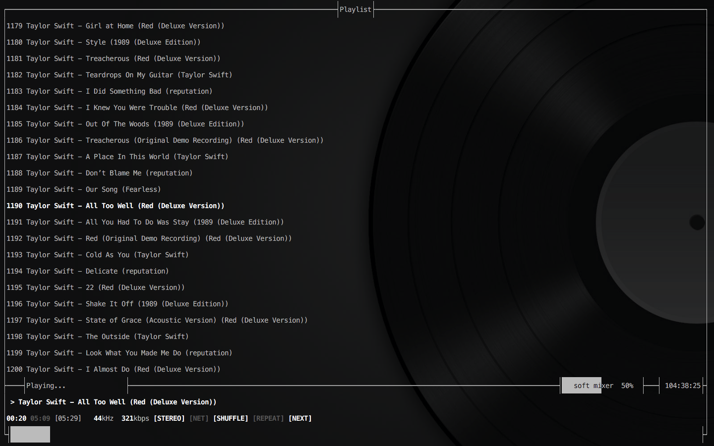

I recently tried out a new music player - a *terminal based* music player!

For context, my OS is macOS Catalina and I have been using a music player called VOX for the longest time (ofcourse, I did try many other alternatives, which for one reason or another, didn't stick). What drove me to seek out another music player? Plain curiosity, nothing else.

The music player in question is called : **Music On Console** check out main page here [moc.daper.net](http://moc.daper.net/) and docs [moc.daper.net/node/87](http://moc.daper.net/node/87)

## Installation

Here's how I installed it on my system -

```sh
$brew install jack mocp
```

That's it.

If you don't have homebrew, you should. Look it up here [brew.sh](https://brew.sh/)

## Usage

Ofcourse, I immediately started it like so -

```sh
$mocp
```

and instantly got an error

```sh
Running the server...
Trying JACK...

FATAL_ERROR: No valid sound driver!


FATAL_ERROR: Server exited!
```

After some googling about, I found out that **jack** is actually a service that you need to start.
Run **brew info jack** for more information. Any way, running below did the trick.

```sh
$brew services start jack
```

Now running **mocp** again gave me :



## Customization

I did tweak it a bit to get to the state shown in the image. In my case, it is set to a hot-key in [iTerm](https://iterm2.com/) that automatically opens a window dedicated to music player and run it (with set background and fonts). The player is also configured with custom keymaps and config. I copied them over from my brew installation folder to **~/.moc/** folder.

Next on my todo list is to bind the mac keyboard's next/play/pause button to mocp commands. Then, I'll have a fully function music player that barely consumes any resources and works on global single key strokes. 

Oh, did I mention that uninstalling VOX cleaned up about 800 MBs worth of space?

I feel like I will be using this music player for the distant future (It works on all unixes I use). Give it a shot and let me know how it goes. Cheers!
